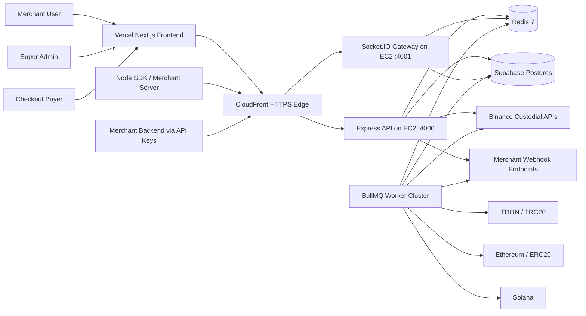

# Paycrypt Crypto Gateway SaaS

Paycrypt is a production-oriented crypto payment gateway platform built as a multi-service TypeScript monorepo. It provides a Stripe-like payment API, hosted crypto checkout, merchant and super-admin dashboards, JWT authentication, long-lived developer API keys, realtime payment updates, usage-metered subscriptions, webhook delivery, and worker-based settlement orchestration.

## Live deployment

- Frontend: https://paycrypt-web-live.vercel.app
- API edge: https://d1jm86cy6nqs8t.cloudfront.net
- Backend origin: http://ec2-65-2-34-31.ap-south-1.compute.amazonaws.com:4000
- WebSocket origin: http://ec2-65-2-34-31.ap-south-1.compute.amazonaws.com:4001
- AWS region: `ap-south-1`
- Database: Supabase PostgreSQL via shared session pooler

## Repository layout

- `apps/web`: Next.js App Router frontend for landing page, merchant console, admin console, hosted checkout, and public payment pages
- `apps/api`: Express REST API with JWT auth, API keys, payment lifecycle, webhooks, billing, admin controls, and merchant data APIs
- `apps/ws`: Socket.IO realtime gateway with Redis fan-out and payment event delivery
- `apps/worker`: BullMQ worker cluster for monitoring, retries, settlement processing, webhook delivery, and telemetry heartbeats
- `packages/shared`: shared Zod schemas, domain types, plan definitions, and cross-service contracts
- `packages/sdk`: Node.js SDK for merchant integrations
- `supabase/migrations`: complete PostgreSQL schema and indexes for Supabase
- `infra/aws`: EC2, Docker Compose, and deployment assets
- `docs`: supporting platform notes

## Platform architecture



## Request and event flow

### Merchant dashboard flow

1. Merchant opens the Vercel frontend.
2. Frontend calls the CloudFront HTTPS API endpoint.
3. API authenticates the merchant with JWT access tokens and refresh-token cookies.
4. Dashboard APIs read metrics, payments, transactions, wallets, API keys, subscriptions, and webhook logs from Supabase.
5. Realtime payment state changes arrive over Socket.IO through CloudFront and Redis pub/sub.

### Hosted checkout flow

1. Merchant creates a payment intent or payment link through dashboard APIs or API keys.
2. API stores the payment, pricing quote, network choice, expiry, wallet route, and hosted-checkout metadata.
3. Buyer lands on `/pay/[id]` and sees supported crypto assets, supported networks, QR code, wallet address, timer, and live state.
4. Worker services observe custody and chain activity.
5. Payment state progresses through `payment.created`, `payment.pending`, `payment.confirmed`, or `payment.failed`.
6. Webhook jobs and settlement jobs are queued and processed asynchronously.

### Admin control flow

1. Super admin logs in through the dedicated admin login.
2. Admin dashboard manages merchants, wallet eligibility, subscriptions, revenue views, risk views, API keys, and operational status.
3. Non-custodial access is feature-gated per merchant and controlled centrally.

## Core feature map

### Authentication

- Custom JWT access tokens with 30 minute expiry
- Refresh tokens stored as HTTP-only cookies and persisted in PostgreSQL
- Cross-site production refresh flow configured with `Secure` and `SameSite=None`
- Merchant and admin consoles separated by role-aware login routing

### API key platform

- Public keys with `pk_live_...`
- Secret keys with `sk_live_...`
- Scoped permissions
- Manual rotation support
- Per-key rate limiting and usage tracking
- Stripe-like payment APIs for payments, payment links, transactions, subscriptions, and webhooks

### Wallet model

- Default custodial wallet path through Binance
- Feature-gated non-custodial support for TRON, Ethereum, and Solana
- Super-admin control over merchant eligibility for non-custodial wallets
- Pricing and subscription gating layered on top of wallet access

### Realtime and jobs

- Socket.IO gateway for payment and merchant room subscriptions
- Redis pub/sub for cross-node event fan-out
- BullMQ workers on Redis 7 for:
  - payment confirmation checks
  - Binance transaction monitoring
  - blockchain monitoring
  - webhook dispatch
  - settlement processing

### Billing and subscriptions

- Starter, Business, Premium, and Custom plan shapes in shared configuration
- Usage tracking for API activity and transaction volume
- Billing invoice support in PostgreSQL
- Merchant billing summaries and admin subscription controls

## Services and runtime responsibilities

### Frontend

- Next.js 15 App Router
- TypeScript
- TailwindCSS
- Framer Motion
- Merchant dashboard
- Super-admin dashboard
- Hosted checkout and public payment-link pages

### API

- Express TypeScript service
- JWT auth, refresh token issuance, API key verification
- Payment creation, payment link creation, transactions, subscriptions, webhooks, admin APIs
- Redis-backed telemetry and realtime event publishing

### Realtime gateway

- Socket.IO server
- Merchant room and payment room subscriptions
- Redis subscriber for broadcasting payment events
- Health telemetry written back to PostgreSQL

### Worker cluster

- BullMQ queues and workers
- Webhook retries and status logging
- Settlement persistence
- Chain observation hooks and custody monitors
- Worker heartbeat metrics

## Database model

Supabase PostgreSQL stores the platform state with indexed relational tables including:

- `users`
- `merchants`
- `api_keys`
- `wallets`
- `payments`
- `transactions`
- `subscriptions`
- `usage_logs`
- `webhook_logs`
- `audit_logs`
- `billing_invoices`
- `settlements`
- `refresh_tokens`
- `worker_heartbeats`
- `ws_health`

Run migrations with:

```bash
npm run migrate:db
```

Seed demo data with:

```bash
npm run seed:demo
```

## Local development

1. Copy `.env.example` to `.env`.
2. Install dependencies with `npm install`.
3. Ensure Redis 6 or Redis 7 is running locally.
4. Run `npm run migrate:db`.
5. Run `npm run seed:demo`.
6. Start the services:

```bash
npm run dev:api
npm run dev:ws
npm run dev:worker
npm run dev:web
```

Default local URLs:

- Frontend: `http://localhost:3003`
- API: `http://localhost:4000`
- WS: `http://localhost:4001`

## Production deployment

### Backend on AWS EC2

The backend stack is designed to run with Docker Compose on EC2 and consists of:

- API service
- WebSocket service
- Worker service
- Redis service

Deploy path:

1. Bootstrap the EC2 host with Docker, Node, and Git.
2. Copy the repository and production `.env` to `/opt/paycrypt`.
3. Run `docker compose up -d --build`.
4. Place CloudFront in front of the EC2 API and WebSocket ports.
5. Point the frontend to the CloudFront distribution URL.

Important production note:

- Supabase direct connections for this project resolve to IPv6 only from AWS, so the backend uses the Supabase shared session pooler connection string for IPv4-compatible access.

### Frontend on Vercel

The frontend is deployed separately from the backend.

Required public build env values:

- `NEXT_PUBLIC_API_BASE_URL=https://d1jm86cy6nqs8t.cloudfront.net`
- `NEXT_PUBLIC_WS_URL=https://d1jm86cy6nqs8t.cloudfront.net`

The active frontend deployment is:

- `https://paycrypt-web-live.vercel.app`

## Security posture

- JWT access tokens with short expiry
- Refresh tokens stored in PostgreSQL and transmitted via HTTP-only secure cookies
- API key hashing
- Redis-backed rate limiting
- Idempotency protection for API operations
- Webhook signature support
- Role-based merchant and super-admin separation
- BullMQ job retries for delivery and settlement reliability

## Operational checks

### Health endpoints

- API readiness: `https://d1jm86cy6nqs8t.cloudfront.net/ready`
- API origin readiness: `http://ec2-65-2-34-31.ap-south-1.compute.amazonaws.com:4000/ready`

### Verified live checks

- CloudFront `/ready` returns healthy database and Redis state
- Merchant login works through the live backend
- Merchant dashboard overview returns live seeded data
- Vercel frontend login page is publicly reachable
- Cross-origin login from Vercel origin returns `Access-Control-Allow-Origin` and `Access-Control-Allow-Credentials: true`
- Refresh cookie is issued with `Secure` and `SameSite=None`

## Demo credentials

- Merchant: `owner@nebula.dev` / `ChangeMe123!`
- Admin: `admin@cryptopay.dev` / `AdminChangeMe123!`

## Environment model

Use the shared pooler on IPv4-only environments.

Example production database URL:

```bash
postgresql://postgres.lqpionhiifsjehyqeydm:<PASSWORD>@aws-1-ap-northeast-1.pooler.supabase.com:5432/postgres
```

See `.env.example` for the full variable list.