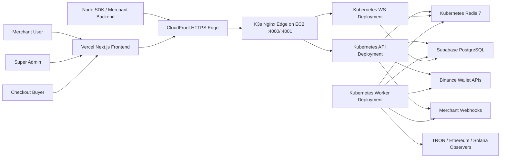

# Paycrypt

Paycrypt is a crypto-native payment gateway SaaS platform built as a TypeScript monorepo. It includes a Next.js merchant and admin frontend, an Express API, a Socket.IO realtime gateway, BullMQ workers, a Supabase PostgreSQL data model, and deployment assets for Vercel plus AWS EC2/K3s Kubernetes.

## Canonical Workspace

The only active project folder is:

- [C:\Users\salma\paycrypt](/C:/Users/salma/paycrypt)

This is the single source of truth for code, deployment config, Supabase migrations, seed scripts, documentation, and AWS assets.

## Live Deployment

- Frontend: [https://paycrypt-omega.vercel.app](https://paycrypt-omega.vercel.app)
- Public docs: [https://paycrypt-omega.vercel.app/docs](https://paycrypt-omega.vercel.app/docs)
- API edge: [https://d1jm86cy6nqs8t.cloudfront.net](https://d1jm86cy6nqs8t.cloudfront.net)
- API ready: [https://d1jm86cy6nqs8t.cloudfront.net/ready](https://d1jm86cy6nqs8t.cloudfront.net/ready)
- WS ready: [http://ec2-65-2-34-31.ap-south-1.compute.amazonaws.com:4001/ready](http://ec2-65-2-34-31.ap-south-1.compute.amazonaws.com:4001/ready)
- AWS region: `ap-south-1`
- Backend runtime: K3s Kubernetes on EC2 with Nginx edge, API, WS, worker, and Redis pods
- Container registry: AWS ECR

Latest verified frontend production deployment:

- project: `paycrypt`
- deployment URL: [https://paycrypt-qaiz3qe2y-numans-projects-a947d1ec.vercel.app](https://paycrypt-qaiz3qe2y-numans-projects-a947d1ec.vercel.app)
- alias: [https://paycrypt-omega.vercel.app](https://paycrypt-omega.vercel.app)
- verified: `2026-04-30`

## Platform Scope

- merchant login and dashboard
- super-admin login and dashboard
- JWT access tokens plus refresh-token cookies
- Stripe-like API key model with `pk_live_` and `sk_live_`
- hosted crypto checkout at `/pay/[id]`
- public payment-link pages at `/links/[id]`
- realtime payment updates through Socket.IO
- BullMQ background processing and settlement workflows
- Redis 7.4-backed BullMQ queue processing in production
- Supabase PostgreSQL schema and migrations
- Node SDK
- Binance custodial integration hooks
- feature-gated non-custodial wallet onboarding
- first-login merchant password setup flow
- admin merchant create, update, suspend, and delete lifecycle

## Monorepo Layout

```text
paycrypt/
|-- apps/
|   |-- api/
|   |-- web/
|   |-- ws/
|   `-- worker/
|-- packages/
|   |-- shared/
|   `-- sdk/
|-- supabase/
|   `-- migrations/
|-- infra/
|   |-- aws/
|   `-- kubernetes/
|-- scripts/
|-- docs/
|-- .env.example
|-- docker-compose.yml
|-- package.json
`-- vercel.json
```

Additional repo structure details:

- [docs/PROJECT_STRUCTURE.md](/C:/Users/salma/paycrypt/docs/PROJECT_STRUCTURE.md)

## Architecture



## Main Flows

### Merchant dashboard flow

1. Merchant signs in on the Vercel frontend.
2. Frontend calls the CloudFront API edge using JWT access tokens plus refresh cookies.
3. Dashboard APIs fetch ledger, wallet, billing, API key, webhook, and analytics data from Supabase.
4. Realtime status changes arrive through the WS gateway.

### First-login password setup flow

1. Admin creates a merchant from the admin panel.
2. API creates the merchant user with a temporary password and `must_change_password=true`.
3. Merchant signs in once with the temporary password.
4. Frontend redirects to `/setup-password`.
5. API updates the password, clears the forced-reset flag, rotates refresh state, and returns a fresh JWT.
6. Merchant is then allowed into the dashboard.

### Hosted checkout flow

1. Merchant creates a payment intent or payment-link checkout.
2. API resolves the wallet route and quote.
3. Buyer lands on `/pay/[id]`.
4. Frontend fetches public payment state from the live API edge.
5. Realtime payment updates are displayed until confirmation, expiry, or failure.

### Admin flow

1. Super admin signs in through `/admin/login`.
2. Admin console manages merchants, wallet eligibility, subscriptions, custody controls, API keys, revenue, and risk.
3. Non-custodial capability remains hidden from merchants until enabled by admin policy.

## Local Development

1. Create the root `.env` from `.env.example`.
2. Install dependencies:

```bash
npm install
```

3. Run migrations:

```bash
npm run migrate:db
```

4. Seed identities:

```bash
npm run seed:demo
```

`seed:demo` now creates only the canonical merchant and super-admin identities. It does not inject demo payments, demo wallets, demo invoices, or fake dashboard analytics rows.

5. Start the services:

```bash
npm run dev:api
npm run dev:ws
npm run dev:worker
npm run dev:web
```

Default local URLs:

- Frontend: `http://localhost:3003`
- API: `http://localhost:4000`
- WS: `http://localhost:4001`

Full setup details:

- [docs/LOCAL_SETUP.md](/C:/Users/salma/paycrypt/docs/LOCAL_SETUP.md)

## Deployment

### Frontend

- platform: Vercel
- project: `paycrypt`
- repo deploy path: canonical monorepo with Vercel root directory set to `apps/web`

Required frontend envs:

```env
NEXT_PUBLIC_API_BASE_URL=https://d1jm86cy6nqs8t.cloudfront.net
NEXT_PUBLIC_WS_URL=https://d1jm86cy6nqs8t.cloudfront.net
NEXT_PUBLIC_APP_BASE_URL=https://paycrypt-omega.vercel.app
```

Vercel project settings that now work for this monorepo:

- Root Directory: `apps/web`
- Install Command: `npm ci`
- Build Command: `npm run build`
- Output Directory: `.next`

### Backend

- platform: AWS EC2
- runtime: K3s Kubernetes
- services: `edge-nginx`, `api`, `ws`, `worker`, `redis`
- deploy path: `/opt/paycrypt`
- images: AWS ECR `paycrypt/api-gateway`, `paycrypt/ws-service`, `paycrypt/worker-service`

This is the low-cost Kubernetes production path. The manifests are structured so the same service split can move to EKS when the platform needs multi-node autoscaling, managed Redis, and higher concurrency.

Detailed deployment notes:

- [docs/deployment.md](/C:/Users/salma/paycrypt/docs/deployment.md)

## Docs

- API overview: [docs/api.md](/C:/Users/salma/paycrypt/docs/api.md)
- Binance notes: [docs/binance.md](/C:/Users/salma/paycrypt/docs/binance.md)
- Live verification notes: [docs/LIVE_STATUS.md](/C:/Users/salma/paycrypt/docs/LIVE_STATUS.md)
- Local setup: [docs/LOCAL_SETUP.md](/C:/Users/salma/paycrypt/docs/LOCAL_SETUP.md)
- Project structure: [docs/PROJECT_STRUCTURE.md](/C:/Users/salma/paycrypt/docs/PROJECT_STRUCTURE.md)

## Development Credentials

- Merchant: `owner@nebula.dev` / `ChangeMe123!`
- Admin: `admin@cryptopay.dev` / `AdminChangeMe123!`

New merchants created by the admin panel receive a temporary password and are forced through first-login password setup before dashboard access is allowed.

## Binance Reality

The platform is live without Binance credentials, but live custodial wallet issuance and Binance-backed settlement verification still require real `BINANCE_API_KEY` and `BINANCE_API_SECRET` values in the backend environment. Binance Spot Testnet does not replace the wallet `/sapi` paths used by this custody model.
